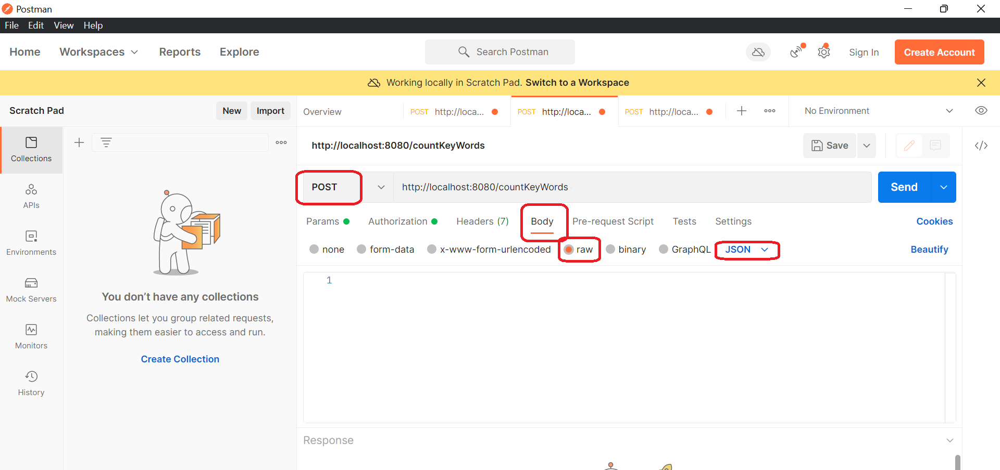

Scenario Quality Checker (SQC)
Dla analityków dokumentujących wymagania funkcjonalne za pomocą scenariuszy nasza aplikacja SQC dostarczy informacji ilościowych oraz umożliwi wykrywanie problemów w wymaganiach funkcjonalnych zapisanych w postaci scenariuszy. Aplikacja będzie dostępna poprzez GUI a także jako zdalne API dzięki czemu można ją zintegrować z istniejącymi narzędziami.


"Notacja scenariuszy do wrzucenia do Readme.md projektu:
• Scenariusz zawiera nagłówek określający jego tytuł i aktorów (zewnętrznych oraz system)
• Scenariusz składa się z kroków (każdy krok zawiera tekst)
• Kroki mogą zawierać pod-scenariusze (dowolny poziom zagłębień)
• Kroki mogą się zaczynać od słów kluczowych: IF, ELSE, FOR EACH

Przykład:
Tytuł: Dodanie książki
Aktorzy:  Bibliotekarz
Aktor systemowy: System

• Bibliotekarz wybiera opcje dodania nowej pozycji książkowej
• Wyświetla się formularz.
• Bibliotekarz podaje dane książki.
• IF: Bibliotekarz pragnie dodać egzemplarze książki
    o Bibliotekarz wybiera opcję definiowania egzemplarzy
    o System prezentuje zdefiniowane egzemplarze
    o FOR EACH egzemplarz:
        • Bibliotekarz wybiera opcję dodania egzemplarza
        • System prosi o podanie danych egzemplarza
        • Bibliotekarz podaje dane egzemplarza i zatwierdza.
        • System informuje o poprawnym dodaniu egzemplarza i prezentuje zaktualizowaną listę egzemplarzy.
• Bibliotekarz zatwierdza dodanie książki.
• System informuje o poprawnym dodaniu książki.
"


Odpalanie programu w PowerShellu: 
```
mvn clean spring-boot:run
```

Generowanie samych javaDoców:
```
mvn javadoc:javadoc 
 
```

Budowanie paczki .jar z javaDocami 
```
mvn clean package
```
Pliki javaDoc znajdują się w: IO_DELTA/target/site/apidocs


Przykładowa konfiguracja pozwalająca na testowanie Resta w narzedziu Postman: 


